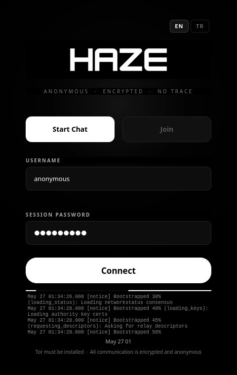
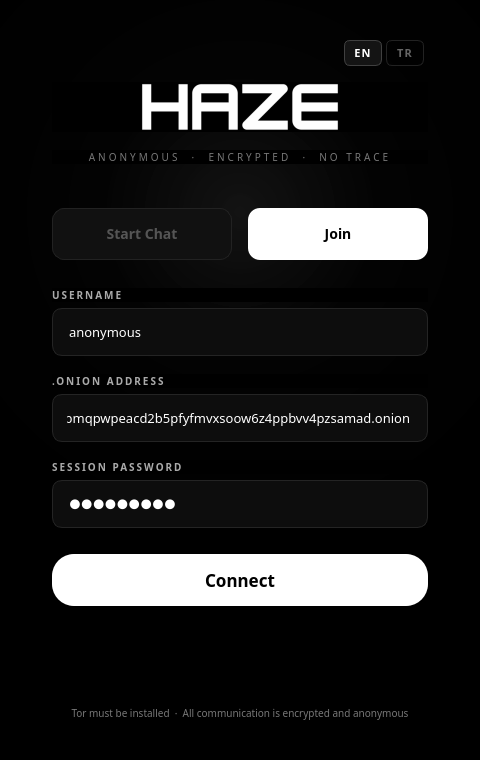

# Haze

**Anonymous · Encrypted · No Trace**

Haze is a peer-to-peer group chat application that routes all traffic through the Tor network. Every session is ephemeral: no accounts, no logs, no persistent keys, no metadata stored anywhere. When the session ends, nothing remains.

---

## Screenshots

<table>
  <tr>
    <td align="center"><b>Login Host</b></td>
    <td align="center"><b>Login Join</b></td>
  </tr>
  <tr>
    <td></td>
    <td></td>
  </tr>
  <tr>
    <td align="center"><b>Chat</b></td>
    <td align="center"><b>Protocol Info</b></td>
  </tr>
  <tr>
    <td></td>
    <td></td>
  </tr>
</table>

---

## Features

### Privacy & Security
- **Zero identity** — no usernames stored, no accounts, no registration
- **Tor-only transport** — all traffic enters and exits through the Tor network via ephemeral hidden services
- **End-to-end encryption** — X25519 ECDH key exchange, ChaCha20-Poly1305 cipher, HKDF-SHA256 key derivation
- **Ephemeral sessions** — session keys are generated fresh each run and never written to disk
- **Session password** — optionally protect a session with a password; clients must provide the correct password before the handshake completes
- **Panic button** — one click broadcasts a panic signal to all participants, overwrites all session keys with zeros, and exits immediately via `os._exit(0)`, bypassing all Python cleanup handlers
- **Zero logs** — no message history, no connection logs, no IP addresses stored at any point
- **Circuit renewal** — rotate Tor circuits on demand without dropping active sessions or disconnecting any participants
- **Secret Vault** — save encrypted session transcripts locally, protected by a separate vault password; supports a duress (decoy) password that silently wipes all saved sessions

### Chat
- **Multi-session tabs** — run multiple independent host or join sessions simultaneously in one window
- **File transfer** — send arbitrary files end-to-end encrypted; inline preview for images
- **Voice notes** — hold-to-record audio messages sent as encrypted WAV chunks
- **Disappearing messages** — configurable auto-delete timer (30 s / 5 min / 1 h / off)
- **Edit and delete** — right-click any of your own messages to edit or delete for all participants
- **Typing indicators** — real-time "… is typing" feedback
- **Message search** — full-text search across the current session with keyboard navigation
- **Kick** — host can remove any participant at any time

### Interface
- **Web browser access** — participants without the native app can join via Tor Browser at `http://<onion>.onion` (port 80); the web client is end-to-end encrypted and shares the same session as native clients
- **Frameless native UI** — custom OLED-black interface built with PyQt6; no system window decorations
- **Animated Tor circuit visualiser** — live diagram showing the routing path from client through guard, relay, and hidden service nodes
- **QR code sharing** — display the `.onion` address as a scannable QR code
- **Latency indicator** — colour-coded dot in the title bar showing real-time Tor round-trip quality
- **Themes** — Haze (default dark), Hacker (green-on-black), Light
- **Multi-language** — English and Turkish interface

---

## How It Works

### Network model

Haze operates in two roles:

**Host** — starts a Tor hidden service. Two virtual ports are mapped:
- Port 80 → HTTP/WebSocket server for Tor Browser clients
- Port 5222 → TCP server for native Haze clients

The `.onion` address is shown in the title bar and can be shared with participants out-of-band.

**Join** — connects to an existing session by entering a `.onion` address. The connection is made over SOCKS5 through Tor, so the client's IP is never exposed to the host or any other participant.

```
Native client               Host (hidden service)           Tor Browser client
     |                             |                                |
     |--- Tor (port 5222) -------->|<---------- Tor (port 80) ------|
     |    (E2E encrypted)          |           (E2E encrypted)      |
```

### Handshake and key exchange

Each native TCP connection performs a one-pass ECDH key exchange with optional password authentication:

1. **Client → Host**: `hello` — X25519 public key, nickname, SHA-256 password hash
2. **Host**: verifies password hash if a session password is set; sends `auth_failed` and closes on mismatch
3. **Host → Client**: `welcome` — host public key and session key wrapped under the ECDH-derived key
4. **Host → Client**: encrypted `userlist` of currently connected participants
5. **Host → All**: encrypted `join` broadcast

The session key is a 32-byte random value generated once per host instance. It is shared with each client by wrapping it under a per-connection ECDH-derived key so the plaintext session key never appears on the wire.

Key derivation uses HKDF-SHA256 with the info string `haze-protocol-v1`. All subsequent messages are encrypted with ChaCha20-Poly1305 using per-message random 12-byte nonces.

Password hashing uses SHA-256 with a fixed prefix: `SHA-256("haze-session-v1:" + password)`. The hash is sent in the `hello` message; the plaintext password never leaves the client.

Web clients (Tor Browser) authenticate through the WebSocket `join` event using the same hash computed via the Web Crypto API.

### Wire protocol

Messages are framed with a 4-byte big-endian length prefix followed by a JSON payload. Maximum message size is 1 MB. Encrypted messages have the form:

```json
{
  "type": "encrypted",
  "nonce": "<base64>",
  "ciphertext": "<base64>"
}
```

The inner plaintext carries the actual event: `chat`, `join`, `leave`, `panic`, `userlist`, `typing`, `delete`, `edit`, `file_start`, `file_chunk`, `file_end`, `ping`, `pong`, or `kicked`.

### Tor integration

Haze uses the `stem` library to launch and control a dedicated Tor process isolated from any system-wide Tor installation:

- SocksPort: random in range 19050–19150
- ControlPort: random in range 19200–19350
- Local TCP port: random in range 50000–59999
- HTTP port: random in range 50000–59999 (separate from TCP port)

The hidden service is created as an ephemeral service (`detached=False`). The private key is generated by Tor and held only in memory; it is never written to disk. When the application exits, the service is removed and the temporary data directory is deleted.

**Circuit renewal** sends a `NEWNYM` signal to the Tor control port, which causes Tor to build new circuits for subsequent connections. Existing connections — including the hidden service and all active sessions — are not interrupted.

---

## Security Model

| Property | Implementation |
|---|---|
| Transport anonymity | Tor onion routing; client IP is never revealed to the host |
| Message confidentiality | ChaCha20-Poly1305 with per-message random nonces |
| Forward secrecy | Ephemeral session keys; a new key is generated for every session |
| Key exchange | X25519 ECDH with HKDF-SHA256 derivation |
| Session access control | Optional SHA-256 password hash verified before key exchange |
| Persistent storage | None — no database, no files, no cookies |
| Panic wipe | `os._exit(0)` — bypasses Python `atexit` and GC; session keys zeroed before exit |
| Hidden service key | Never written to disk; held in Tor process memory only |
| Web client encryption | Same E2E session key via WebSocket; Tor transport provides additional layer |

### Limitations

- The host is a trusted relay. The host can read plaintext messages after decryption. Haze is designed for small, trust-based groups.
- Nicknames are not authenticated. Any participant can choose any nickname not already taken in the current session.
- Tor provides anonymity at the network layer but does not protect against endpoint compromise.
- Web clients rely on Tor's transport encryption in addition to the application-layer session key. Using the native app is recommended for higher security assurance.

---

## Requirements

- Python 3.11 or later
- Tor (`tor` binary must be in `PATH`)
- A desktop environment with Qt6 support

| Package | Purpose |
|---|---|
| PyQt6 >= 6.6.0 | Native UI |
| stem >= 1.8.2 | Tor control |
| cryptography >= 42.0.0 | X25519, ChaCha20-Poly1305, HKDF |
| python-socks[asyncio] >= 2.4.4 | SOCKS5 proxy for join mode |
| aiohttp >= 3.9 | Web/WebSocket server for Tor Browser access |
| qrcode >= 8.0 | QR code generation |
| sounddevice >= 0.4.6 | Voice note recording (optional) |
| numpy >= 1.26 | Audio processing for voice notes (optional) |

---

## Installation

### AppImage (recommended — no Python required)

Download the latest `Haze-x86_64.AppImage` from the [releases page](https://haze.berkkucukk.com):

```bash
chmod +x Haze-x86_64.AppImage
./Haze-x86_64.AppImage
```

Tor must be installed separately:

| Distribution | Command |
|---|---|
| Arch Linux | `sudo pacman -S tor` |
| Ubuntu / Debian | `sudo apt install tor` |
| Fedora | `sudo dnf install tor` |

### From source

#### Arch Linux

```bash
sudo pacman -S tor
git clone <repository-url>
cd haze
bash installer/install.sh
```

#### Ubuntu / Debian

```bash
sudo apt install tor
git clone <repository-url>
cd haze
bash installer/install.sh
```

#### Fedora

```bash
sudo dnf install tor
git clone <repository-url>
cd haze
bash installer/install.sh
```

The installer creates a Python virtual environment at `~/.local/share/haze/venv`, installs a launcher at `~/.local/bin/haze`, and registers a desktop entry so Haze appears in the application menu.

If `~/.local/bin` is not in your `PATH`, add this to your shell configuration:

```bash
export PATH="$HOME/.local/bin:$PATH"
```

### Uninstall

```bash
bash installer/install.sh --uninstall
```

---

## Usage

Launch from the terminal or the application menu:

```bash
haze
```

### Starting a session (host)

1. Select **Start Chat**
2. Enter a nickname
3. Optionally enter a **session password** — only clients who know this password will be able to join
4. Click **Connect** — Tor bootstraps and a `.onion` address appears in the title bar
5. Share the `.onion` address (and password, if set) with participants through a separate secure channel

### Joining a session

1. Select **Join**
2. Enter your nickname, the `.onion` address, and the session password (if the session requires one)
3. Click **Connect**

### Web access

Participants without the native app can join by opening `http://<onion-address>.onion` in **Tor Browser**. The web client:
- Is end-to-end encrypted using the same session key as native clients
- Supports the session password
- Works transparently alongside native clients in the same session

For maximum security the native app is recommended, as it provides stronger guarantees around key handling and process isolation.

### Circuit renewal

Click the **⟳ Circuit** button in the title bar to rotate Tor circuits. New connections will use fresh circuits while all existing sessions and participants remain connected.

### Panic button

The **PANIC** button in the title bar initiates an emergency wipe:

- A `panic` signal is broadcast to all connected participants
- All session keys are overwritten with zeros
- All connections are terminated
- The process exits immediately via `os._exit(0)`

Participants who receive a panic signal are prompted to wipe their own sessions.

### Protocol info

Clicking **● HAZE PROTOCOL** in the title bar opens the connection info panel:

- Live animated Tor circuit diagram
- Encryption parameters (cipher, key exchange, KDF)
- Connection details (transport, onion address, SOCKS port)
- Privacy guarantees (zero logs, anonymous routing)

### Multiple sessions

Click **＋ New Session** in the left sidebar to open additional host or join sessions in separate tabs. Each session has its own independent Tor hidden service, encryption keys, and participant list.

### Secret Vault

The vault stores encrypted session transcripts locally. Access it from the sidebar. You can set a vault lock password and an optional duress password — entering the duress password silently wipes all saved sessions.

---

## Building the AppImage

```bash
bash build/build_appimage.sh
```

Requires: `curl`, `tar`, `python3` (any version). Downloads a self-contained Python 3.11 runtime and bundles all dependencies. The output is `Haze-x86_64.AppImage` in the project root.

## Building from source (development)

```bash
python -m venv .venv
source .venv/bin/activate
pip install -e .
haze
```

---

## Project Structure

```
haze/
├── src/haze/
│   ├── crypto/
│   │   └── e2e.py           # X25519 ECDH, ChaCha20-Poly1305, HKDF
│   ├── network/
│   │   ├── protocol.py      # Wire framing (4-byte length prefix + JSON)
│   │   ├── server.py        # Host-mode asyncio TCP server + password auth
│   │   ├── client.py        # Join-mode asyncio client (Tor SOCKS5)
│   │   └── web_server.py    # HTTP/WebSocket bridge for Tor Browser clients
│   ├── tor/
│   │   └── controller.py    # stem integration, hidden service, circuit renewal
│   ├── secure/
│   │   └── memory.py        # Session wipe utilities
│   ├── storage/
│   │   ├── settings.py      # Persistent user settings
│   │   └── vault.py         # Encrypted session transcript storage
│   ├── ui/
│   │   ├── main_window.py   # Chat window, title bar, all overlay popups
│   │   ├── setup_dialog.py  # Login / setup dialog with Tor log output
│   │   ├── styles.py        # Global QSS stylesheet + theme definitions
│   │   └── tray.py          # System tray integration
│   ├── i18n.py              # English / Turkish translations
│   └── main.py              # Entry point
├── installer/
│   └── install.sh           # Bash installer (venv + desktop entry)
├── build/
│   └── build_appimage.sh    # Self-contained AppImage builder
├── screenshots/
└── pyproject.toml
```

---

## Disclaimer

Haze is provided for research and educational purposes. It is designed to demonstrate privacy-preserving communication techniques. The authors make no warranties regarding the security of this software. Users are responsible for understanding the legal implications of using anonymity tools in their jurisdiction.

Tor provides strong anonymity guarantees at the network layer, but no software can protect against a compromised endpoint, a malicious host, or physical access to the device.
