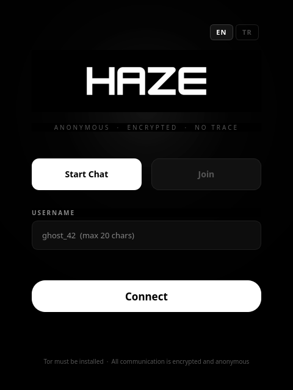
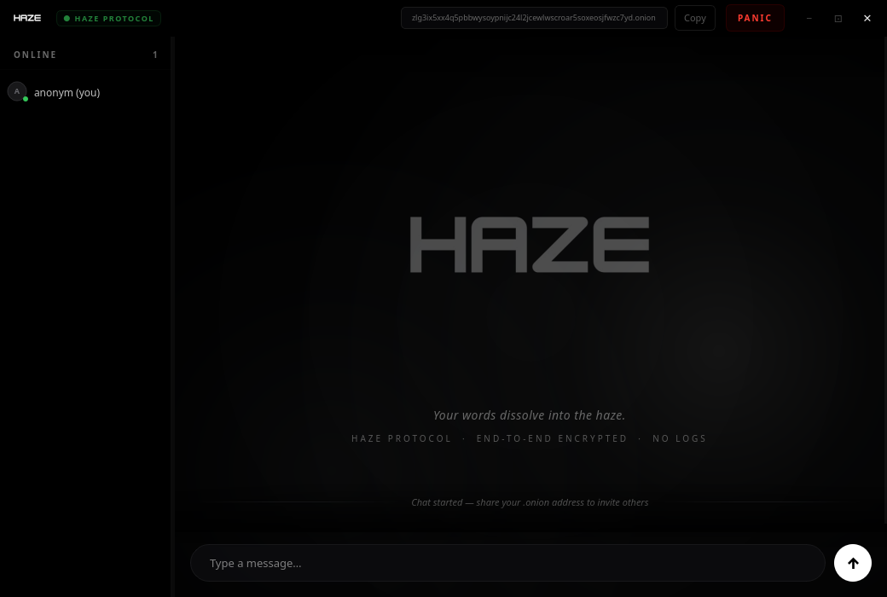
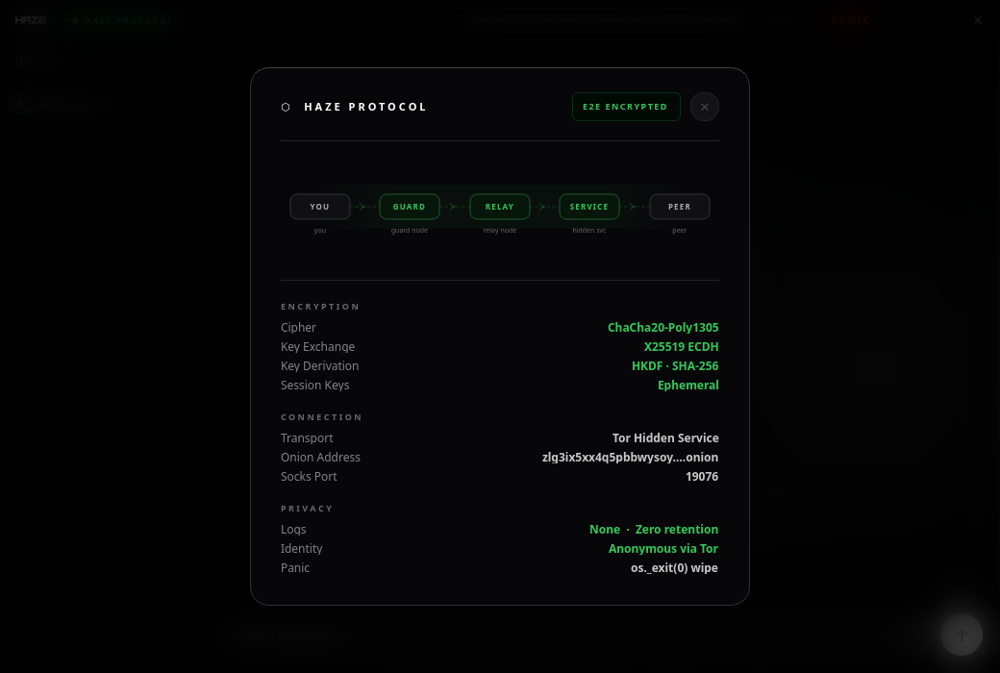

# Haze

**Anonymous · Encrypted · No Trace**

Haze is a peer-to-peer group chat application that routes all traffic through the Tor network. Every session is ephemeral: no accounts, no logs, no persistent keys, no metadata stored anywhere. When the session ends, nothing remains.

---

## Screenshots

<table>
  <tr>
    <td align="center"><b>Login</b></td>
    <td align="center"><b>Chat</b></td>
    <td align="center"><b>Protocol Info</b></td>
  </tr>
  <tr>
    <td></td>
    <td></td>
    <td></td>
  </tr>
</table>

---

## Features

- **Zero identity** — no usernames stored, no accounts, no registration
- **Tor-only transport** — all traffic enters and exits through the Tor network via ephemeral hidden services
- **End-to-end encryption** — X25519 ECDH key exchange, ChaCha20-Poly1305 cipher, HKDF-SHA256 key derivation
- **Ephemeral sessions** — session keys are generated fresh each run and never written to disk
- **Panic button** — one click wipes session keys, terminates all connections, and forces immediate process exit via `os._exit(0)`, bypassing all Python cleanup handlers
- **Zero logs** — no message history, no connection logs, no IP addresses stored at any point
- **Frameless native UI** — custom OLED-black interface built with PyQt6; no system window decorations
- **Animated Tor circuit visualizer** — live diagram of the routing path with real-time status
- **Multi-language** — English and Turkish interface

---

## How It Works

### Network model

Haze operates in two roles:

**Host** — starts a Tor hidden service. The `.onion` address is shown in the title bar and can be shared with participants out-of-band. The host's machine acts as the relay server; all messages pass through it.

**Join** — connects to an existing session by entering a `.onion` address. The connection is made over a SOCKS5 proxy to Tor, so the client's IP address is never exposed to the host or to any other participant.

```
Client A                    Host (hidden service)              Client B
   |                               |                               |
   |--- Tor circuit --------------->|<-------------- Tor circuit ---|
   |       (encrypted + anonymous) |       (encrypted + anonymous) |
```

### Handshake and key exchange

Each connection performs a one-pass ECDH key exchange:

1. **Client → Host**: `hello` message containing the client's X25519 public key and chosen nickname
2. **Host → Client**: `welcome` message containing the host's public key and the session key wrapped with the ECDH-derived key
3. **Host → Client**: encrypted `userlist` of currently connected participants
4. **Host → All**: encrypted `join` broadcast

The session key is a 32-byte random value generated once per host instance. It is shared with each client by wrapping it under a per-connection ECDH-derived key so that the plaintext session key never appears on the wire.

Key derivation uses HKDF-SHA256 with the info string `haze-protocol-v1`. All subsequent messages are encrypted with ChaCha20-Poly1305 using per-message random 12-byte nonces.

### Wire protocol

Messages are framed with a 4-byte big-endian length prefix followed by a JSON payload. Maximum message size is 1 MB. Encrypted messages have the form:

```json
{
  "type": "encrypted",
  "nonce": "<base64>",
  "ciphertext": "<base64>"
}
```

The inner plaintext (after decryption) carries the actual event type: `chat`, `join`, `leave`, `panic`, or `userlist`.

### Tor integration

Haze uses the `stem` library to launch and control a dedicated Tor process. The process is isolated from any system-wide Tor installation by using randomised ports:

- SocksPort: random in range 19050–19150
- ControlPort: random in range 19200–19350
- Local relay port: random in range 50000–59999

The hidden service is created as an ephemeral service (`detached=False`). The private key is generated by Tor and held only in memory; it is never written to disk. When the application exits, the service is removed and the temporary data directory is deleted.

---

## Security Model

| Property | Implementation |
|---|---|
| Transport anonymity | Tor onion routing; client IP is never revealed to the host |
| Message confidentiality | ChaCha20-Poly1305 with per-message nonces |
| Forward secrecy | Ephemeral session keys; a new key is generated for every session |
| Key exchange | X25519 ECDH with HKDF-SHA256 derivation |
| Persistent storage | None. No database, no files, no cookies |
| Panic wipe | `os._exit(0)` — bypasses Python `atexit` handlers and garbage collection; session keys are overwritten with zeros before exit |
| Hidden service key | Never written to disk; generated and held in Tor process memory only |

### Limitations

- The host is a trusted relay. The host can see message metadata (timing, sender nick) in cleartext after decryption. Haze is designed for small, trust-based groups.
- Nicknames are not authenticated. Any participant can choose any nickname that is not already taken in the current session.
- Tor provides anonymity at the network layer but does not protect against endpoint compromise.

---

## Requirements

- Python 3.11 or later
- Tor (`tor` binary must be in `PATH`)
- A desktop environment with Qt6 support

| Package | Version |
|---|---|
| PyQt6 | >= 6.6.0 |
| stem | >= 1.8.2 |
| cryptography | >= 42.0.0 |
| python-socks[asyncio] | >= 2.4.4 |

---

## Installation

### Arch Linux (recommended)

```bash
sudo pacman -S tor
git clone <repository-url>
cd haze
bash installer/install.sh
```

### Ubuntu / Debian

```bash
sudo apt install tor
git clone <repository-url>
cd haze
bash installer/install.sh
```

### Fedora

```bash
sudo dnf install tor
git clone <repository-url>
cd haze
bash installer/install.sh
```

The installer creates a Python virtual environment at `~/.local/share/haze/venv`, installs a launcher script at `~/.local/bin/haze`, and registers a desktop entry so Haze appears in the application menu.

If `~/.local/bin` is not in your `PATH`, add the following line to your shell configuration:

```bash
export PATH="$HOME/.local/bin:$PATH"
```

### Uninstall

```bash
bash installer/install.sh --uninstall
```

---

## Usage

Launch from the terminal or the application menu:

```bash
haze
```

### Starting a session (host)

1. Select **Start Chat**
2. Enter a nickname
3. Click **Connect** — Tor will bootstrap and a `.onion` address will appear in the title bar
4. Share the `.onion` address with participants through a separate secure channel

### Joining a session

1. Select **Join**
2. Enter your nickname and the `.onion` address provided by the host
3. Click **Connect**

### Panic button

The **PANIC** button in the title bar initiates an emergency wipe:

- A `panic` signal is broadcast to all connected participants
- All session keys are overwritten with zeros
- All connections are terminated
- The process exits immediately via `os._exit(0)`

Participants who receive a panic signal are prompted to wipe their own sessions.

### Protocol info

Clicking **HAZE PROTOCOL** in the title bar opens the connection info panel, which displays:

- A live animated Tor circuit diagram
- Encryption parameters (cipher, key exchange, KDF)
- Connection details (transport, onion address, Socks port)
- Privacy guarantees (zero logs, anonymous routing)

---

## Project Structure

```
haze/
├── src/haze/
│   ├── crypto/
│   │   └── e2e.py          # X25519 ECDH, ChaCha20-Poly1305, HKDF
│   ├── network/
│   │   ├── protocol.py     # Wire framing (4-byte length prefix + JSON)
│   │   ├── server.py       # Host-mode asyncio TCP server
│   │   └── client.py       # Join-mode asyncio client (Tor SOCKS5)
│   ├── tor/
│   │   └── controller.py   # stem integration, ephemeral hidden service
│   ├── secure/
│   │   └── memory.py       # Session wipe utilities
│   ├── ui/
│   │   ├── main_window.py  # Chat window, title bar, protocol popup
│   │   ├── setup_dialog.py # Login dialog
│   │   ├── styles.py       # Global QSS stylesheet
│   │   └── tray.py         # System tray
│   ├── i18n.py             # English / Turkish translations
│   └── main.py             # Entry point
├── installer/
│   └── install.sh          # Bash installer
├── screenshots/
└── pyproject.toml
```

---

## Building from Source

```bash
python -m venv .venv
source .venv/bin/activate
pip install -e .
haze
```

---

## Disclaimer

Haze is provided for research and educational purposes. It is designed to demonstrate privacy-preserving communication techniques. The authors make no warranties regarding the security of this software. Users are responsible for understanding the legal implications of using anonymity tools in their jurisdiction.

Tor provides strong anonymity guarantees at the network layer, but no software can protect against a compromised endpoint, a malicious host, or physical access to the device.
